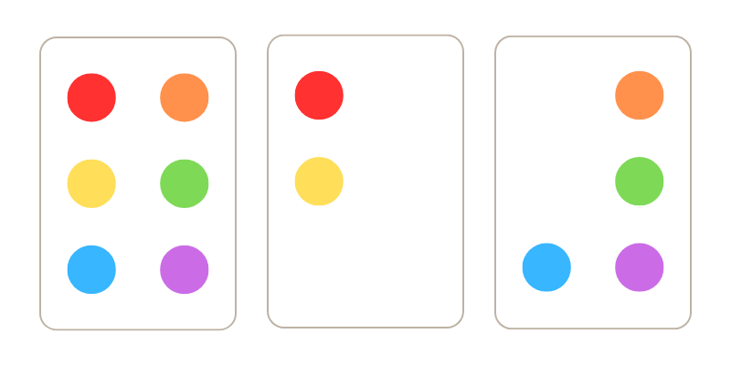

# Daily Discrete Deck (3D)

**Authors:** Maja Giglok, Gabriela Pietras, Anna Szpak

---

## Main Idea
A single-player card game where time is a factor, and players can practice perfection (making a mistake results in losing). Progress from the last and current month, as well as player statistics, are saved in a calendar.

## Calendar
A simplified version of a calendar for two months. It displays how often the game was played, the total number of completed games, and high scores.

## Game
The game is Projective Set. It consists of $2^6-1=63$ cards. Each card has at most one dot in one of six colors. The dot in each color either exists or doesn't. There are (almost) always 7 cards on the board. After a player's move, cards are added from the unused stack of cards. When the stack runs out of cards and there are 7 or fewer cards on the screen, the player must collect these cards manually, even though they always form a SET. The player chooses any non-empty subset of cards (at least 3 cards because cards are not repeated, and there is no "empty" card) and confirms their choice. If each dot in the set appears an even number of times, we call it a SET. Correctly chosen cards disappear and are not involved in further gameplay. If the player makes a mistake, they lose. The game ends when there are no more cards. The game time is measured throughout the game.

## Card Design
Sample cards — image below.

## Implementation
- Button "NEW GAME" resets the game.
- Button "SURRENDER" shows the set of cards forming a SET and ends the game.
- Button "X" cancels the selection of cards.
- Button "CONFIRM" confirms the selected cards.
- Button "SUM" shows the XOR (sum mod 2) of the cards chosen by the player.
- The number of collected cards or cards remaining to collect is displayed.
- The time of the game and the best game are displayed.

## Framework/Libraries
libGDX

## Optional
- Rating the player each day based on their scores.
- Store option. Points are earned for playing each day. You can use them to buy different types of cards (different colors/shapes of elements on cards).
- Higher levels - cards have more dots.
